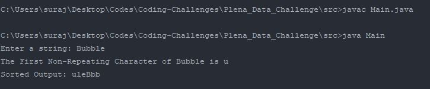

# Coding Challenge by Plena Data

### How to run the Project

1. Download/ Clone the project
2. Open Command prompt and cd into the Plena_Data_Challenge/src
3. Run Following Command to Compile the Program

       `javac Main.java`
           
4. Run the following Command to Run the Program
    
        
        `java Main`
        
        
 #### Example:
 
 